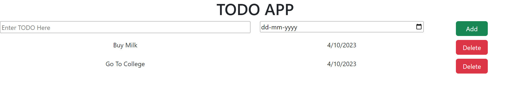

# To-Do App

## Overview
This is a simple To-Do application built using React components. The app allows users to add tasks with a due date and delete tasks once they are completed. It provides a clean and user-friendly interface for managing daily tasks.



## Features
- Add new tasks with a due date.
- Delete tasks from the list.
- User-friendly interface.

## Installation
To run this app locally, follow these steps:

1. Clone the repository:
    ```sh
    git clone https://github.com/dhimanshashank/todo-app.git
    ```
2. Navigate to the project directory:
    ```sh
    cd todo-app
    ```
3. Install the dependencies:
    ```sh
    npm install
    ```
4. Start the development server:
    ```sh
    npm start
    ```

The app should now be running on `http://localhost:3000`.

## Usage
- **Add Task:** Enter a task in the input field and select a due date. Click the "Add" button to add the task to the list.
- **Delete Task:** Click the "Delete" button next to a task to remove it from the list.

## Technologies Used
- React
- HTML
- CSS

## Contributing
Contributions are welcome! Please open an issue or submit a pull request with any improvements or new features.

## License
This project is licensed under the MIT License. See the [LICENSE](./LICENSE) file for details.

## Acknowledgements
This project was developed as part of a learning exercise to practice React and component-based design.
