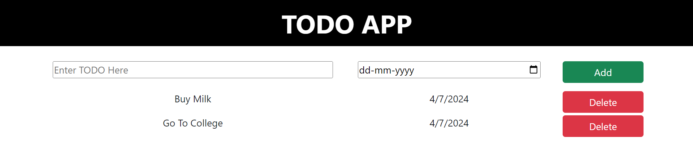

# TODO List App - Version 2



## Overview

A simple and intuitive Todo List application for managing daily tasks. This version includes enhancements for better user experience and better understanding of dynamic data flow across the components. Through this version, I had made the previously hard coded data as the dynamic flow of data by enabling the power of using various components.

## Features

- Add tasks with descriptions and due dates.
- View and manage tasks in a list format.
- Delete tasks upon completion.

## Installation

1. Clone the repository:
   ```bash
   git clone https://github.com/dhimanshashank/React-projects/3-To-do-list-version-two.git
